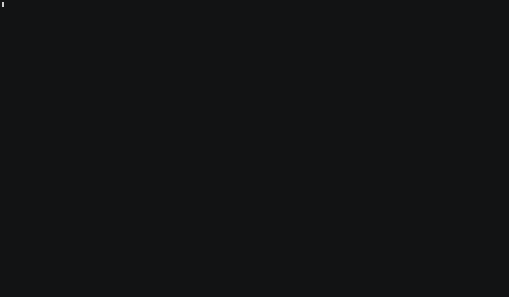

# halive.  An http/s prober, to check which URLs are alive.

Info: This is the README file for halive.
Author: gnc <nebbionegiuseppe@gmail.com>
Copyright: © 2019, gnc.
Date: 2019-08-03
Version: 0.1.0


## PURPOSE

Halive is a software used to get a list of alive hosts starting from a list of
hosts whose status is unknown in a short amount of time. It's fast, indeed
halive achieve its speed through its asynchronous design.

Once we have a list of domains/subdomains gathered from the reconnaissance phase,
(for example through [pdlist](https://github.com/gnebbia/pdlist) we want to check 
fastly which subdomains are alive and which are not.
To this purpose we can use halive and obtain from the initial list of hostnames
only the alive subdomains.


## INSTALLATION

We can install halive simply by doing:
```sh
git clone https://github.com/gnebbia/halive
cd halive
pip install -r requirements.txt
python setup.py install
```


## USAGE

In order to get the list of alive hosts with also the response status code we
can do:
```sh
halive big_list_of_urls.txt
```

The default speed is set through the use of 20 (default) workers, we can
increase the speed by increasing the number of workers, by doing:
```sh
halive big_list_of_urls.txt -t 100
# in this case we use 100 workers
```

We can also print only URLs without response code and store results in a text
file, by doing:
```sh
halive big_lists_of_urls.txt -t 100 --only-urls --output report.txt 
```

We can also only filter URLs which do not reply with 4XX HTTP codes, this can be
done by executing halive in this way:
```sh
halive big_lists_of_urls.txt -t 100 --only-success --only-urls --output report.txt 
```

A usage example in the gif below:



## COPYRIGHT

Copyright © 2019, gnc.
All rights reserved.

Redistribution and use in source and binary forms, with or without
modification, are permitted provided that the following conditions are
met:

1. Redistributions of source code must retain the above copyright
   notice, this list of conditions, and the following disclaimer.

2. Redistributions in binary form must reproduce the above copyright
   notice, this list of conditions, and the following disclaimer in the
   documentation and/or other materials provided with the distribution.

3. Neither the name of the author of this software nor the names of
   contributors to this software may be used to endorse or promote
   products derived from this software without specific prior written
   consent.

THIS SOFTWARE IS PROVIDED BY THE COPYRIGHT HOLDERS AND CONTRIBUTORS
"AS IS" AND ANY EXPRESS OR IMPLIED WARRANTIES, INCLUDING, BUT NOT
LIMITED TO, THE IMPLIED WARRANTIES OF MERCHANTABILITY AND FITNESS FOR
A PARTICULAR PURPOSE ARE DISCLAIMED.  IN NO EVENT SHALL THE COPYRIGHT
OWNER OR CONTRIBUTORS BE LIABLE FOR ANY DIRECT, INDIRECT, INCIDENTAL,
SPECIAL, EXEMPLARY, OR CONSEQUENTIAL DAMAGES (INCLUDING, BUT NOT
LIMITED TO, PROCUREMENT OF SUBSTITUTE GOODS OR SERVICES; LOSS OF USE,
DATA, OR PROFITS; OR BUSINESS INTERRUPTION) HOWEVER CAUSED AND ON ANY
THEORY OF LIABILITY, WHETHER IN CONTRACT, STRICT LIABILITY, OR TORT
(INCLUDING NEGLIGENCE OR OTHERWISE) ARISING IN ANY WAY OUT OF THE USE
OF THIS SOFTWARE, EVEN IF ADVISED OF THE POSSIBILITY OF SUCH DAMAGE.
